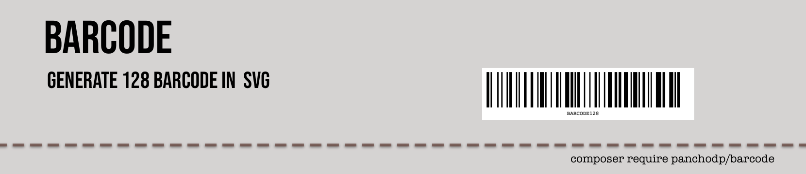

<p align="center"><a target="_blank"> </a></p>

<p align="center">
<a ></a>
<a ></a>
<a href="https://packagist.org/packages/panchodp/barcode"></a>
<a href="https://packagist.org/packages/panchodp/barcode"></a>
<a href="https://github.com/PanchoDP/barcode/actions/workflows/tests.yml"></a>
</p>

> [!IMPORTANT]
> Caution: This package is a work in progress and may not be production-ready. Use at your own risk.


# Barcode 128 Generator

A simple PHP library to generate Code 128 barcodes in SVG format. Compatible with both **Laravel** and **pure PHP** projects.

## Features

✅ **Laravel & Pure PHP Compatible** - Works with both Laravel and standalone PHP projects  
✅ **Code 128 Support** - Full support for Code Set A, B and C with automatic selection  
✅ **SVG Output** - Scalable vector graphics (no GD dependency)  
✅ **Highly Customizable** - Colors, margins, text, dimensions  
✅ **Multiple Output Formats** - String, file, base64 data URL  
✅ **Auto-discovery** - Laravel 5.5+ automatic service provider registration

## Installation

### For Laravel Projects

```bash
composer require panchodp/barcode
```

The package will be **automatically discovered** by Laravel 5.5+. Optionally publish the config:

```bash
php artisan vendor:publish --tag=barcode-config
```

### For Pure PHP Projects

```bash
composer require panchodp/barcode
```

## Usage

### Laravel Usage (with Facades)

```php
use Barcode\Facades\Barcode;

// Generate binary pattern
$pattern = Barcode::generate('123456789');

// Generate SVG with quick options
$svg = Barcode::generateWithOptions('123456789', 3, 80);

// Generate SVG with full customization
$svg = Barcode::generateSvg('HELLO123', 'Custom Text', [
    'bar_width' => 3,
    'bar_height' => 80,
    'background_color' => '#f0f0f0',
    'foreground_color' => '#333333',
    'show_text' => true
]);

// Save to file
Barcode::generateSvgFile('ABC123', 'barcode.svg', [
    'bar_width' => 2,
    'bar_height' => 60
]);

// Generate base64 for web
$dataUrl = Barcode::generateSvgBase64('WEB789');
echo '';

// Validate code
if (Barcode::validateCode('123456789')) {
    echo "Valid barcode data";
}
```

### Laravel Usage (with Dependency Injection)

```php
use Barcode\Barcode;

class BarcodeController extends Controller
{
    public function generate(Barcode $barcode)
    {
        $svg = $barcode->generateSvg('123456789');
        return response($svg)->header('Content-Type', 'image/svg+xml');
    }
    
    public function download(Barcode $barcode)
    {
        $filename = storage_path('app/barcode.svg');
        $barcode->generateSvgFile('ORDER123', $filename);
        
        return response()->download($filename);
    }
}
```

### Pure PHP Usage

```php
<?php

require_once 'vendor/autoload.php';

use Barcode\Barcode;

$barcode = new Barcode();

// Generate binary pattern
$pattern = $barcode->generate('123456789');

// Generate SVG
$svg = $barcode->generateSvg('HELLO123');

// Generate SVG with custom options
$customSvg = $barcode->generateSvg('CODE128', '', [
    'bar_width' => 3,
    'bar_height' => 80,
    'margin_left' => 20,
    'margin_right' => 20,
    'margin_top' => 10,
    'margin_bottom' => 30,
    'show_text' => true,
    'background_color' => '#FFFFFF',
    'foreground_color' => '#000000',
    'text_size' => 12,
    'text_margin' => 5
]);

// Save SVG to file
$barcode->generateSvgFile('ABC123', 'barcode.svg', [
    'bar_width' => 2,
    'bar_height' => 60,
    'show_text' => true
]);

// Generate SVG as base64 for web
$svgBase64 = $barcode->generateSvgBase64('WEB789', [
    'bar_width' => 2,
    'bar_height' => 50,
    'show_text' => true
]);
echo '';

// Validate code
if ($barcode->validateCode('123456789')) {
    echo "Valid code";
}
```

### Using Facades (Laravel or Pure PHP)

```php
use Barcode\Facades\Barcode;

// Works in both Laravel and pure PHP
$pattern = Barcode::generate('123456789');
$svg = Barcode::generateSvg('HELLO123');
$isValid = Barcode::validateCode('TEST123');
```

## Available Methods

### Main Class (Barcode)

- `generate(string $code, array $options = [])` - Generate binary pattern of the barcode
- `generateWithOptions(string $code, int $width = 2, int $height = 60)` - Generate SVG with basic options
- `generateSvg(string $code, string $text = '', array $options = [])` - Generate SVG with full options
- `generateSvgFile(string $code, string $filename, array $options = [])` - Generate and save SVG to file
- `generateSvgBase64(string $code, array $options = [])` - Generate SVG as base64 data URL
- `validateCode(string $code)` - Validate if a code is valid (max 48 characters)
- `getBinaryPattern(string $code)` - Get the binary pattern

## Customization Options

```php
$options = [
    'bar_width' => 2,                   // Width of each bar (pixels)
    'bar_height' => 60,                 // Height of bars (pixels)
    'margin_left' => 10,                // Left margin
    'margin_right' => 10,               // Right margin
    'margin_top' => 10,                 // Top margin
    'margin_bottom' => 10,              // Bottom margin
    'background_color' => '#FFFFFF',    // Background color
    'foreground_color' => '#000000',    // Bar color
    'show_text' => true,                // Show text below barcode
    'text_size' => 12,                  // Text size
    'text_margin' => 5                  // Text margin
];

// Laravel
$svg = Barcode::generateSvg('123456789', 'Custom Text', $options);

// Pure PHP
$barcode = new Barcode();
$svg = $barcode->generateSvg('123456789', 'Custom Text', $options);
```

## Laravel Configuration

After publishing the config file, you can set default options in `config/barcode.php`:

```php
return [
    'defaults' => [
        'bar_width' => 2,
        'bar_height' => 60,
        'margin_left' => 10,
        'margin_right' => 10,
        'margin_top' => 10,
        'margin_bottom' => 10,
        'background_color' => '#FFFFFF',
        'foreground_color' => '#000000',
        'show_text' => true,
        'text_size' => 12,
        'text_margin' => 5,
    ],
];
```

## Visual Layout Guide

```
┌─────────────────────────────────────────────┐ ← margin_top
│                background_color             │
│  ┌─margin_left                margin_right─┐│
│  │ ███ █ ██ █ ███ █ ██ █ ███               ││ ← bar_height
│  │ ███ █ ██ █ ███ █ ██ █ ███               ││   (foreground_color)
│  │ ███ █ ██ █ ███ █ ██ █ ███               ││
│  │                                         ││
│  │         ↑ text_margin                   ││
│  │        BARCODE123                       ││ ← text_size
│  └─────────────────────────────────────────┘│
└─────────────────────────────────────────────┘ ← margin_bottom
          ↑
       bar_width
```

### Option Details:

- **`bar_width`**: Controls the thickness of each individual bar
- **`bar_height`**: Sets the vertical height of the barcode bars
- **`margin_top/bottom/left/right`**: Adds spacing around the entire barcode
- **`background_color`**: Background color of the entire SVG canvas
- **`foreground_color`**: Color of the barcode bars (typically black)
- **`show_text`**: Whether to display the code text below the barcode
- **`text_size`**: Font size of the displayed text
- **`text_margin`**: Space between the barcode bars and the text

## Code 128 Support

This library supports Code 128 with automatic code set selection:

- **Code Set A**: Uppercase letters, numbers, and control characters
- **Code Set B**: Upper/lowercase letters, numbers, and symbols  
- **Code Set C**: Numbers only (more efficient for numeric data)

The library automatically selects the most efficient code set based on your input data.

## Validation

```php
// Laravel
if (Barcode::validateCode('123456789')) {
    echo "Valid barcode data";
}

// Pure PHP
$barcode = new Barcode();
if ($barcode->validateCode('123456789')) {
    echo "Valid barcode data";
}
```

## Framework Compatibility

| Framework | Support | Installation | Usage |
|-----------|---------|--------------|-------|
| **Laravel 5.5+** | ✅ Full | `composer require panchodp/barcode` | Auto-discovery, facades, DI |
| **Pure PHP** | ✅ Full | `composer require panchodp/barcode` | Direct class usage, manual facades |
| **Symfony** | ✅ Compatible | `composer require panchodp/barcode` | Manual service registration |
| **Other Frameworks** | ✅ Compatible | `composer require panchodp/barcode` | Standard PSR-4 autoloading |

## Examples

Run the included example files:

```bash
# Basic example
php example.php

# Complete SVG example
php ejemplo-svg.php
```

## Requirements

- PHP 8.3+ or PHP 8.4+
- No external dependencies
- Laravel 5.5+ (optional, for Laravel integration)


## License

MIT License. See [LICENSE.md](LICENSE.md) for details.